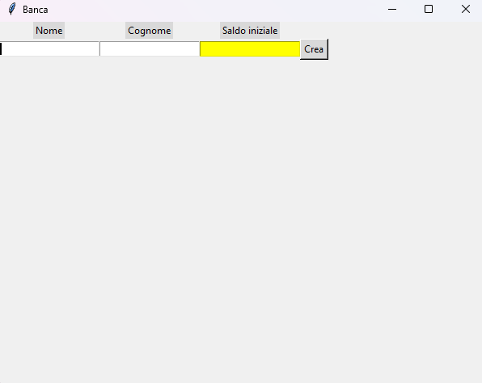
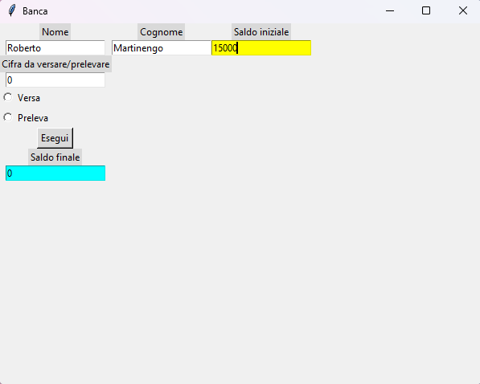
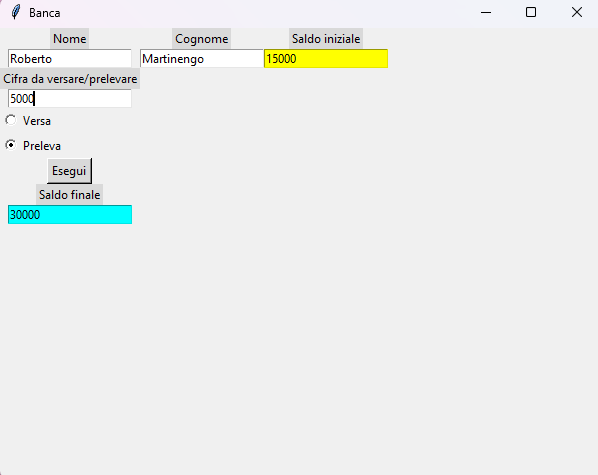

# 🏦 Bank Account Management Application (GUI)

A Python desktop application with a Graphical User Interface (GUI) designed to simulate basic banking operations such as account creation, deposits, and withdrawals. 
Developed as a high-school classroom project (**April 2026**).

## Features
* **Account Initialization:** Create a bank account with owner details and initial deposit validation.
* **Encapsulated State:** Private balance management ensuring data security and integrity.
* **Dynamic GUI:** Interactive interface built with Tkinter featuring conditional layout rendering (`grid_forget`).

## Technical Architecture
* `Banca_classe_init.py`: Implements Object-Oriented Programming (OOP) via the `Conto` class with balance encapsulation (`__saldo`).
* `Banca_GUI.py`: Implements the Tkinter `Finestra` frame, entry forms, radio buttons, and action listeners.

## Technologies Used
* **Language:** Python 3
* **GUI Framework:** Tkinter
* **Design Pattern:** Object-Oriented Programming (OOP)

## Demo / Screenshot

### 1. Avvio dell'Applicazione

### 2. Inserimento Dati / Accesso Conto

### 3. Operazione di Deposito / Prelievo

### 4. Saldo Aggiornato

